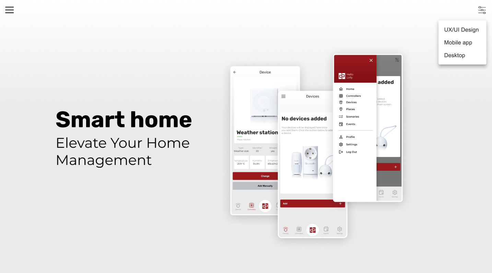
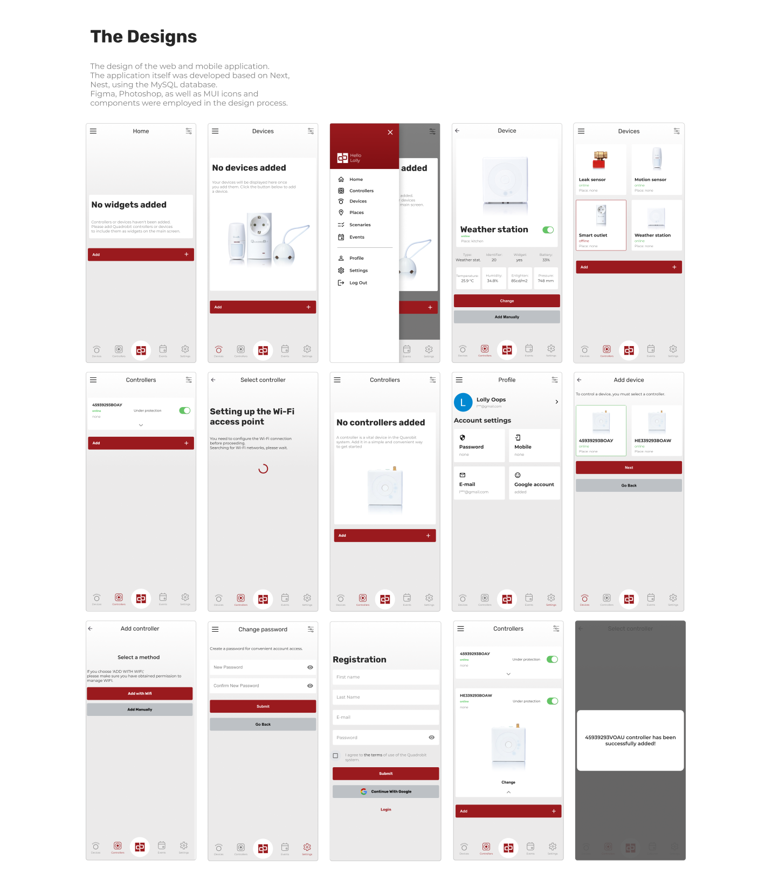

# Smart home app

This project is a smart home system developed using MUI, Next.js, Nest.js and MySQL technologies. 

## Key Features

* Smart Device Management: Users can control their smart devices, such as lighting, thermostats, controllers, and others, through a user-friendly web interface.

* Security and Access Control: Security features, including video surveillance, notification systems, and access control, are implemented to protect the home and its occupants.

* Mobile Device Support: The application is adapted for use on mobile devices, providing convenient access and management of the smart home at any time.

* Integration with Nest.js and MySQL: The project is built using Next.js for the frontend, Nest.js for the backend, and interacts with the MySQL database for data storage.

